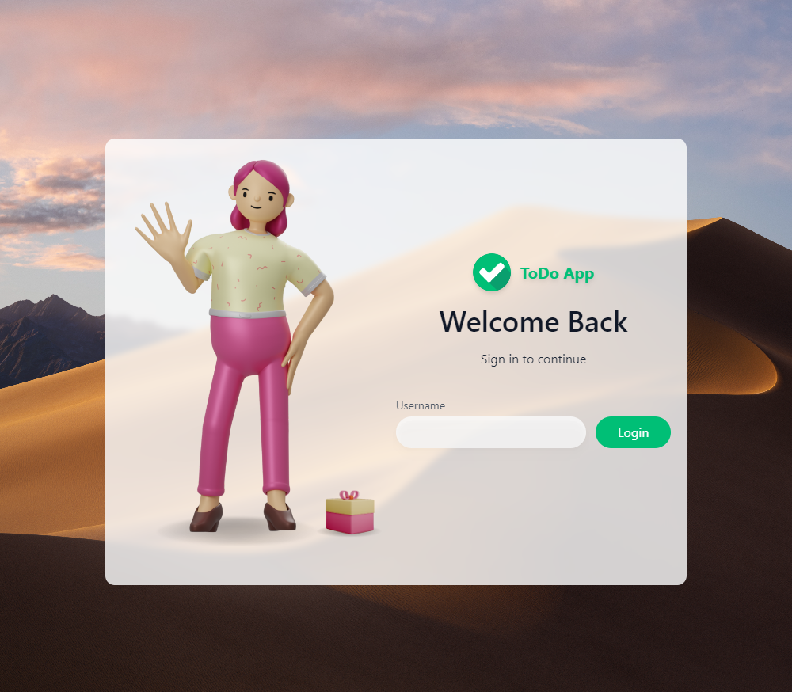
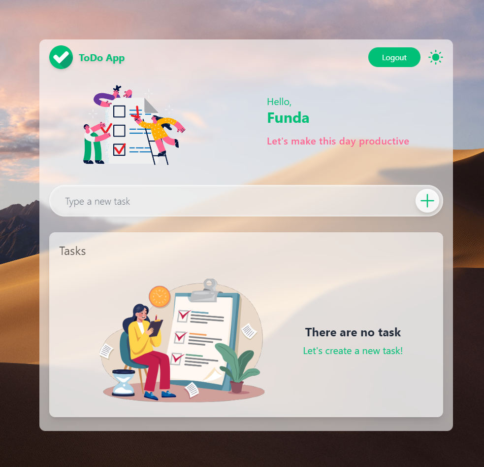
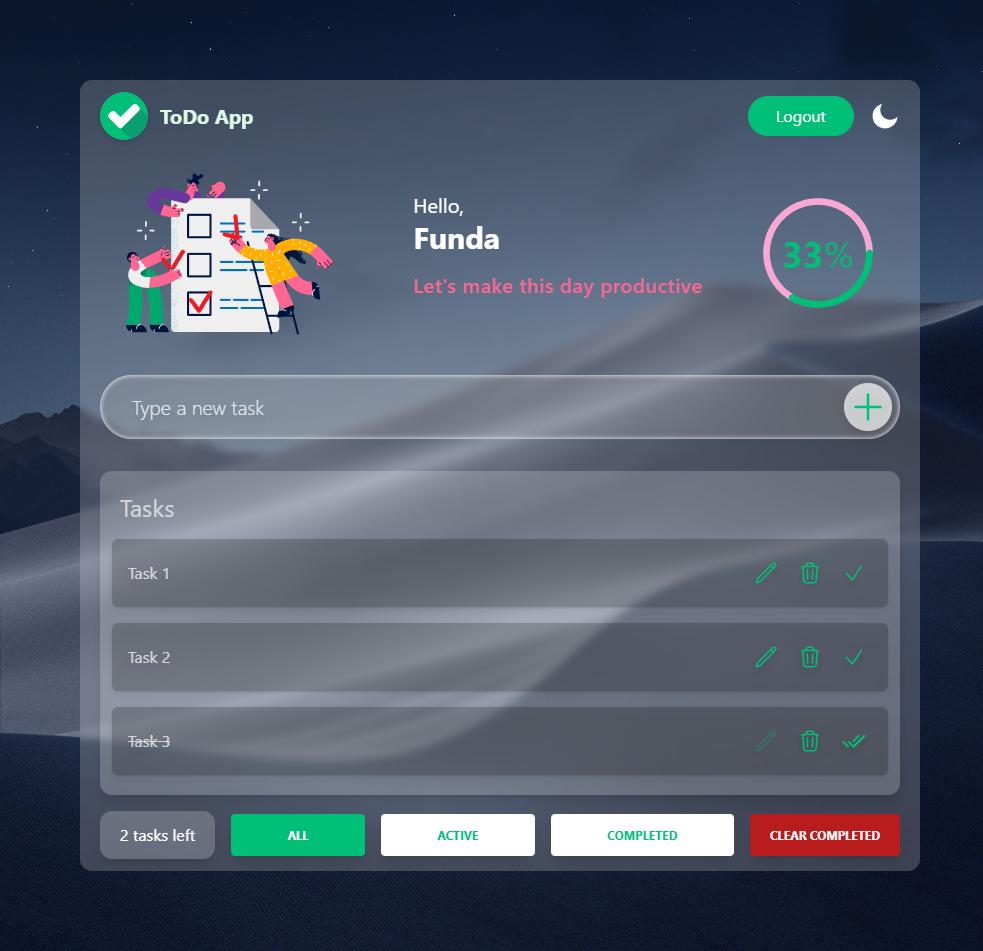
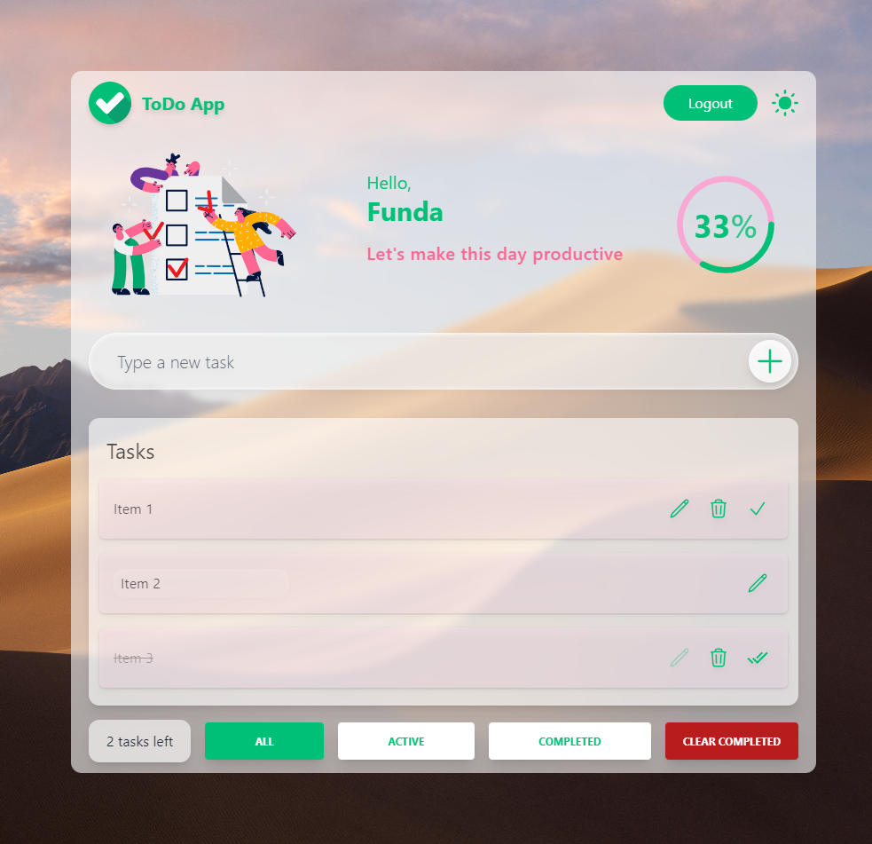
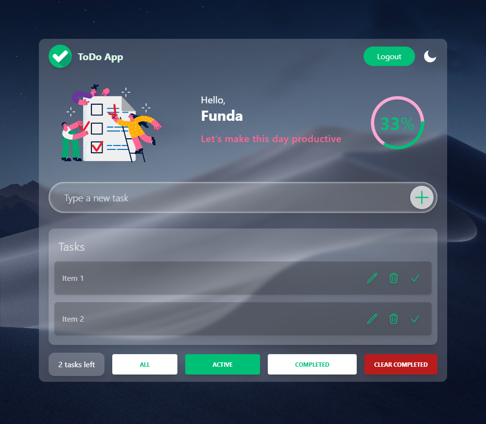
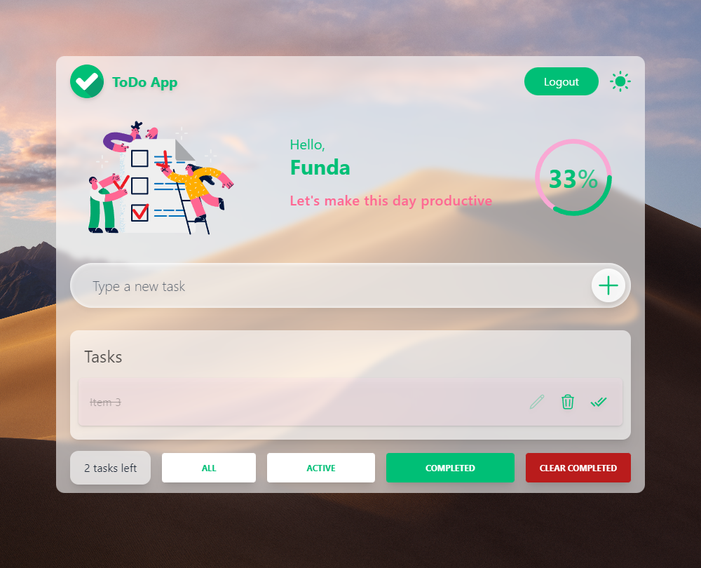
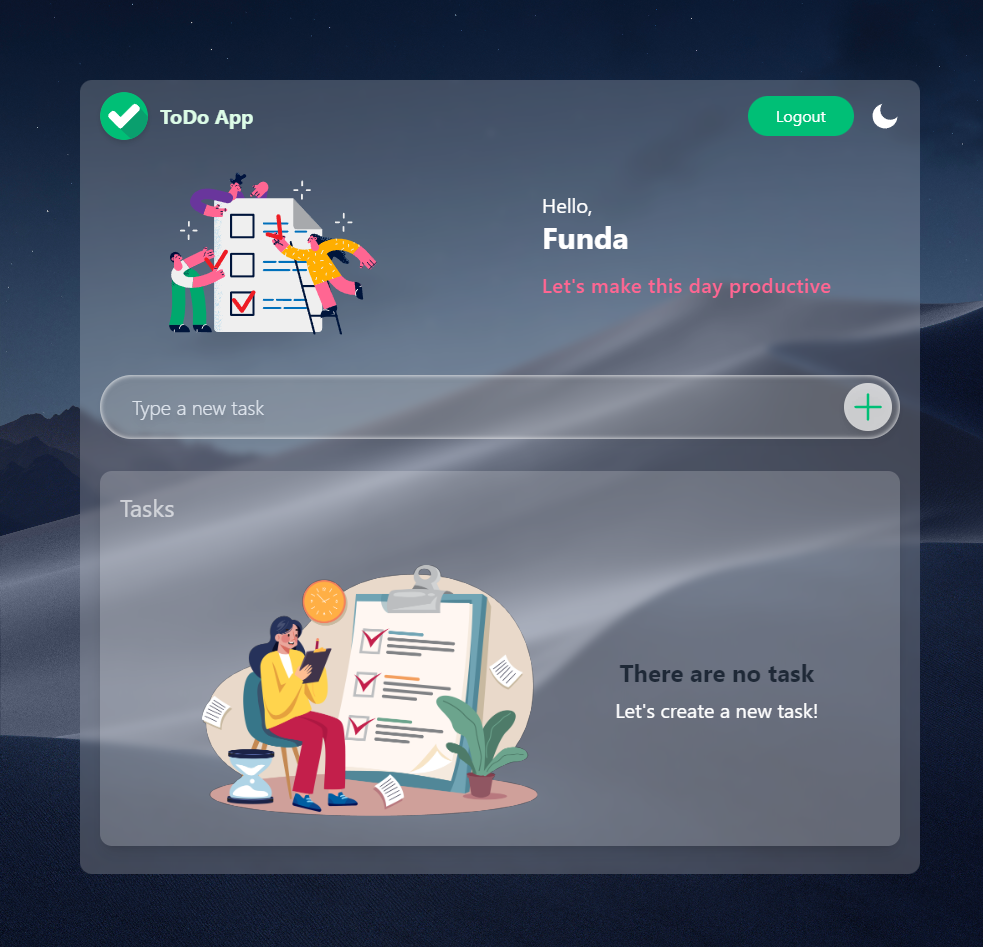

A To-Do List App to Organize Your Work & Life
## Screenshots
<table style="padding:10px">
  <tr> 
    <td></td>
    <td></td>
  </tr>
</table>
<table style="padding:10px">
  <tr> 
    <td></td>
    <td></td>
  </tr>
</table>
<table style="padding:10px">
  <tr> 
    <td></td>
    <td></td>
  </tr>
</table>
<table style="padding:10px">
  <tr> 
    <td></td>
    <td></td>
  </tr>
</table>

## ✨ About The Project

The project was developed with React.js by using React Hooks, styled with Tailwind CSS.

### Tech Stack

- [**React**](https://reactjs.org/)
- [**Tailwind CSS**](https://tailwindcss.com/)

### Library

- [**Recoil**](https://recoiljs.org/)
- [**Axios**](https://axios-http.com/)

### API

- [**mock API**](https://mockapi.io/)

  
## ⚡ Getting Started

These instructions will get you a copy of the project up and running on your local machine for development and testing
purposes.

### Prerequisites

The project can be built with npm or yarn, so choose one of the approach bellow in case you don't have any installed on your system.

- npm is distributed with Node.js which means that when you download Node.js,
  you automatically get npm installed on your computer. [Download Node.js](https://nodejs.org/en/download/)

or

- Yarn is a package manager built by Facebook Team and seems to be faster than npm in general. [Download Yarn](https://yarnpkg.com/getting-started)

### Installing

First clone this repository.
```bash
$ git clone https://github.com/fundakartal/todo-app-react.git
```

Sign up to [mock API](https://mockapi.io/) and create a todo app.

Schema example:

| Parameter     | Type        |
| :------------ | :---------- |
| `id`          | `Object ID` |
| `content`     | `String`    |
| `isCompleted` | `Boolean`   |


Create a file at the root of the project called .env.local with the following contents:

```sh
REACT_APP_URL = YOUR API ENDPOINT
```

Install dependencies. Make sure you already have [`nodejs`](https://nodejs.org/en/) & [`npm`](https://www.npmjs.com/) installed in your system.
```bash
$ npm install # or yarn
```

Run it
```bash
$ npm start # or yarn start
```


## 📬 Contact

[](https://twitter.com/fundakartaI)
[](mailto:kartalfunda01@gmail.com)

## ⭐️ Show Your Support

Please give a ⭐️ if this project helped you!
